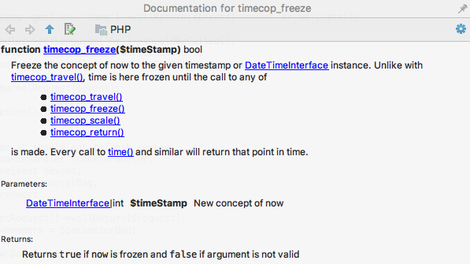

# PHP timecop function stubs

Define and document functions available from [php-timecop](https://github.com/hnw/php-timecop) extension to enable IDE-s code assist for it.

Example from PHPStorm is provided below.

## Installation

Just clone/download this repository somewhere on your computer and point one of your IDE-s include paths to that location. That should provide `timecop_*` functions code assist. 

## Resources

- [php-timecop GitHub repository](https://github.com/hnw/php-timecop)
- [Configure include paths in PHPStorm](https://www.jetbrains.com/help/phpstorm/configuring-include-paths.html)
